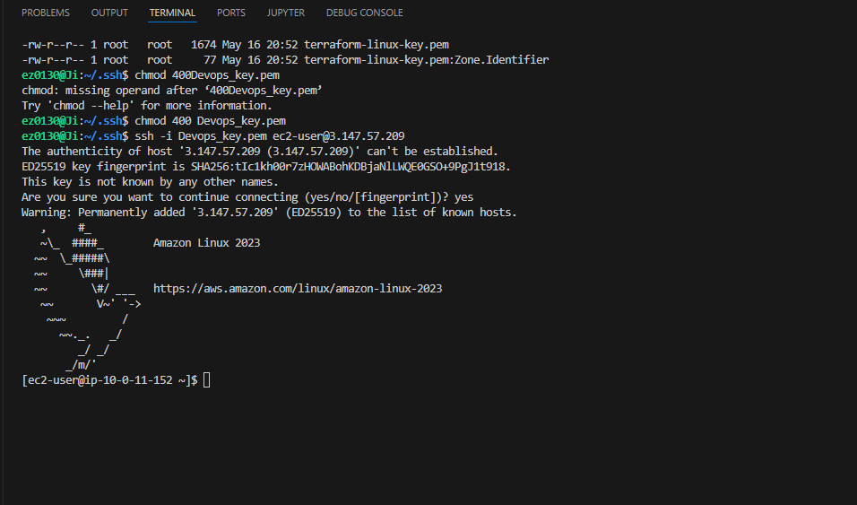

# ☁️ Set Up a Java Web App on AWS EC2 with VS Code

This project walks through launching an EC2 instance, setting up Java and Maven, generating a Java web app, and editing the app remotely via VS Code and the terminal. It’s the first step in a DevOps pipeline series.

---

## 🚀 What I Did

- Launched an **EC2 instance** using Amazon Linux 2023

- Connected via **SSH** using a `Devops_key.pem` key
 
- Installed **Amazon Corretto 8 (Java)** and **Apache Maven**
- Generated a **Java web application** using Maven archetype
  
- Connected **VS Code** to EC2 via **Remote - SSH**
- 
- Edited app files both through **VS Code** and the **terminal**
  
- Explored the project structure and customized `index.jsp`

---

## 🛠 Tools & Services Used

**AWS Services:**
- EC2
- Amazon Corretto

**Development Tools:**
- Apache Maven
- Java 8 (Amazon Corretto)
- VS Code
- Remote - SSH Extension
- nano/vim for terminal editing

---

## 📁 Key Concepts Learned

- SSH configuration and remote access
- Maven project generation (`mvn archetype:generate`)
- Java web project structure (`src`, `webapp`, `index.jsp`)
- Editing files via both VS Code and command-line editors
- Using VS Code as a remote IDE for cloud instances

---

## 🔍 Project Structure Highlights

- `src/main/java`: Java source code
- `src/main/webapp`: Frontend resources (HTML, JSP, etc.)
- `index.jsp`: Homepage of the app, combines Java and HTML
- `pom.xml`: Maven build and dependency configuration

---

## 💡 Reflections

> **One thing I didn’t expect:**  
Editing Java web files in the terminal was simpler and more powerful than I expected.

> **Time Spent:**  
This project took me approximately **2–3 hours**.  
The most challenging part was configuring VS Code's SSH access.  
It was most rewarding to see my Java app structure live on EC2.

> **Why I did this project:**  
To practice DevOps fundamentals with real AWS services and get hands-on experience with Java build tools and cloud environments.

---

## ⏭ What’s Next?

This project is **part one of a series of DevOps projects** where I’m building a **CI/CD pipeline**.  
I'll be working on the next project in **the next day or two** to maintain progress and reinforce these skills.

## Author

Jiyoung Lee
github.com/ez0130
