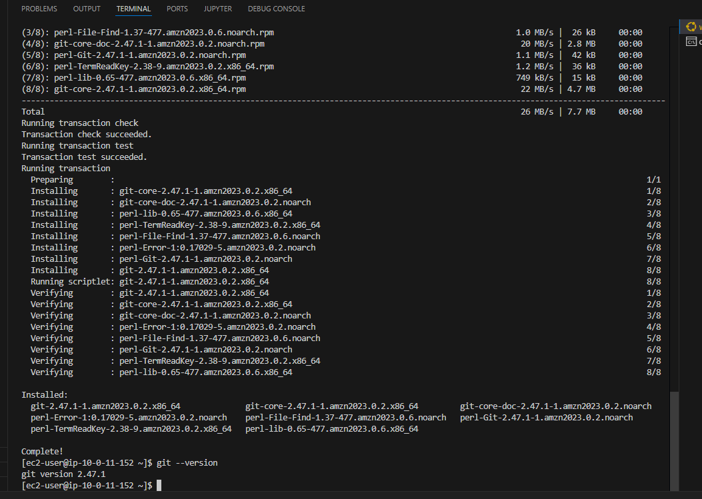
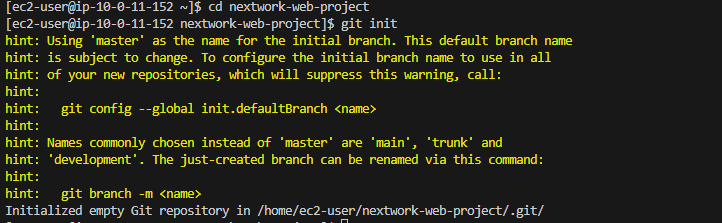
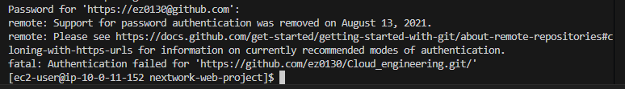
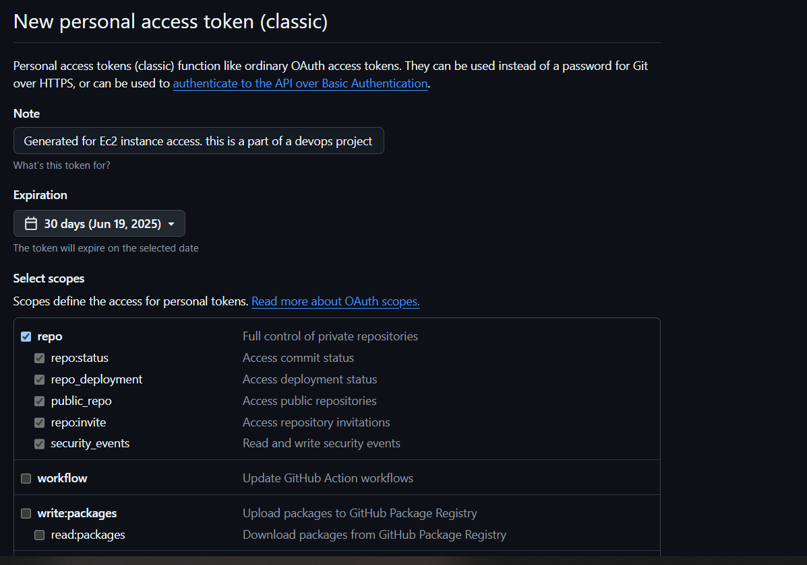

#  Connect a GitHub Repo with AWS EC2

This project connects a Git-tracked Java web application on an EC2 instance to a remote GitHub repository. It's the second step in building a CI/CD pipeline with AWS and DevOps tools.

---

##  Project Summary

In this project, I:

- Initialized a local Git repository in my EC2-hosted Java project

- Committed changes and pushed the project to GitHub

- Used a GitHub **personal access token (PAT)** for authentication

- Explored Git and GitHub workflows on a real cloud server

---

## 🛠 Tools & Services Used

- **EC2** (Amazon Linux 2023)
- **Git & GitHub**
- **VS Code + Remote - SSH**
- **Java (Amazon Corretto) + Maven**
- **Terminal editors** (`nano`)

---

## 🧠 Key Concepts Learned

- Initializing a Git repository:  
  `git init` creates a Git repo and a default branch for version control

- Staging and committing files:  
  - `git add .` adds changes to the staging area  
  - `git commit -m "message"` saves those changes with a message

- Connecting to GitHub:
  - Used `git remote add origin <repo_url>` to link local project to GitHub
  - Used `git push -u origin master` to push and set tracking branch

- GitHub authentication with tokens:  
  GitHub requires a **personal access token (PAT)** instead of passwords

---

## 🔐 GitHub Token Setup

1. Navigate to GitHub → Settings → Developer Settings → Personal Access Tokens
2. Generate a token with **repo** access scope
3. Use the token when prompted for a password during `git push`

---

## 📁 What I Changed

I edited `index.jsp` in my Maven-generated Java web app (`nextwork-web-project`). This helped me test Git version control and confirm updates synced to GitHub.

---

## ⏱ Time & Reflections

> **This project took me approximately 2 hours.**  
> The most challenging part was configuring GitHub authentication.  
> It was most rewarding to push my code and see live updates appear on GitHub.

---

## 📅 What's Next?

This project is **part two** of a DevOps project series where I’m building a full **CI/CD pipeline**.  
I'll be working on the next project **within a day or two** to keep progressing!

---

## ✍️ Author

**Ji Lee**  
NextWork Student | [nextwork.org](https://community.nextwork.org)

