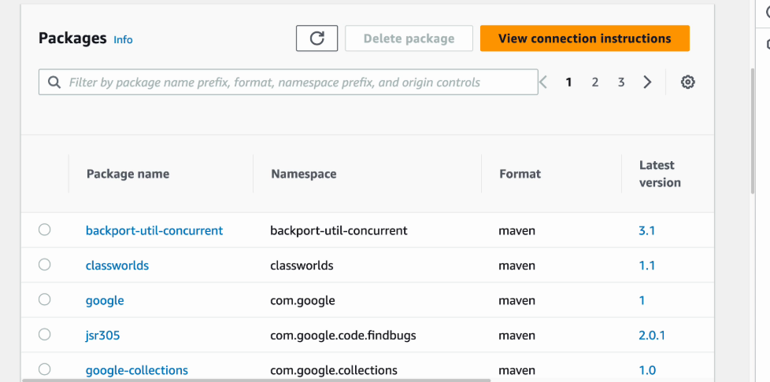

## 📦 Secure Packages with CodeArtifact
### Project Type: DevOps (Part 3 of CI/CD Pipeline Series)

### 🚀 Project Goal
Set up AWS CodeArtifact as a secure, private repository for managing dependencies in a Java web application using Maven. This project emphasizes IAM-based access control and integration into a CI/CD workflow.

### 🛠️ Tools & Services Used
AWS EC2

AWS IAM (Instance Role)

AWS CodeArtifact

Apache Maven

Java (Amazon Corretto 8)

Git + GitHub

Linux (Amazon Linux 2023)

### 🔐 IAM & Security Setup
Created a CodeArtifact IAM policy to allow:

GetAuthorizationToken

ReadFromRepository

Attached this policy to the EC2 instance via IAM Role

Used temporary credentials (best practice) instead of hardcoding access keys

### 🔧 Maven Integration
Configured ~/.m2/settings.xml:
```xml
<servers>
  <server>
    <id>codeartifact</id>
    <username>aws</username>
    <password>${env.CODEARTIFACT_AUTH_TOKEN}</password>
  </server>
</servers>

<profiles>
  <profile>
    <id>codeartifact</id>
    <repositories>
      <repository>
        <id>codeartifact</id>
        <url>https://[domain-id].d.codeartifact.us-east-2.amazonaws.com/maven/[repo-name]/</url>
      </repository>
    </repositories>
  </profile>
</profiles>
```

Used this command to retrieve the token:
```bash
export CODEARTIFACT_AUTH_TOKEN=$(aws codeartifact get-authorization-token \
  --domain devops \
  --domain-owner 044523842610 \
  --region us-east-2 \
  --query authorizationToken \
  --output text)
```
### 🧪 Verification Steps
Successfully compiled the Java web app via Maven using CodeArtifact

Confirmed that Maven pulled dependencies from CodeArtifact

Verified .jsp edits in the local app

Observed that target/ directory and compiled files were not pushed to GitHub (expected due to .gitignore)

### 📘 Lessons Learned
How to securely authenticate Maven with AWS CodeArtifact using IAM

Importance of properly configuring settings.xml

How CI/CD pipelines can integrate secure dependency management

How IAM roles simplify and secure access for EC2-hosted services

### ⏱ Time Spent
~2 hours
Most challenging: Reconnecting with EC2 instance
Most rewarding: Seeing successful Maven–CodeArtifact integration

### 🔄 Next Steps
This is Part 3 of a DevOps project series focused on building a full CI/CD pipeline. The next step will involve automating deployment workflows with CodeDeploy or Jenkins.

### Author: Jiyoung Lee
github.com/ez0130
