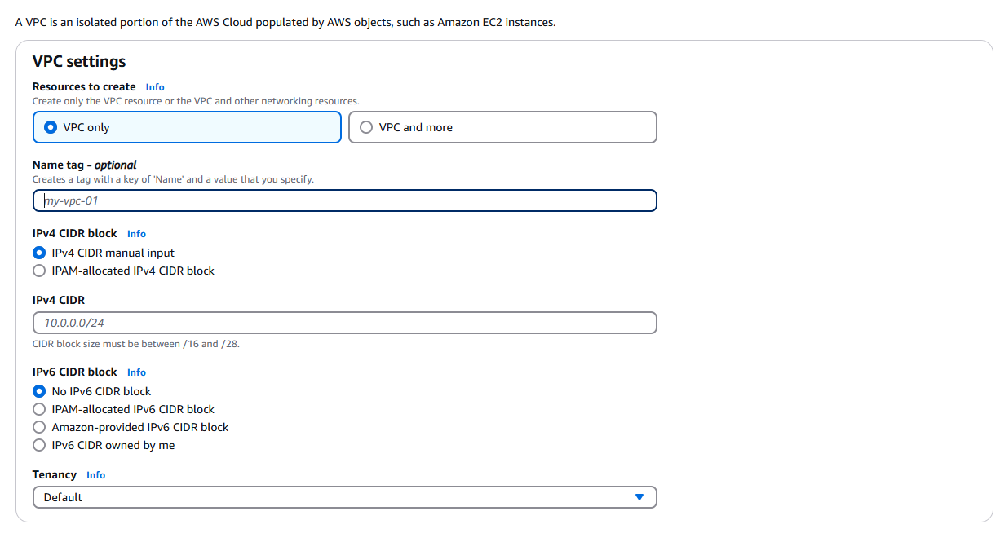
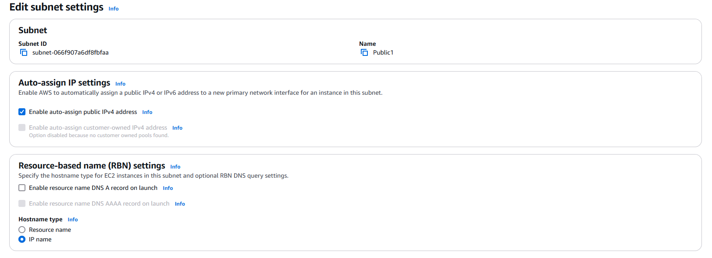
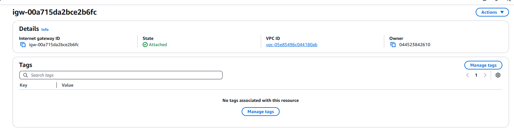

# 🛠️ Amazon VPC Project – EC2 Web Server Deployment

## 📘 Project Summary

This project demonstrates how to build a Virtual Private Cloud (VPC) in AWS using Terraform and configure it to host a publicly accessible EC2 web server (Nginx). It includes hands-on experience with core AWS networking components such as subnets, route tables, internet gateways, and CIDR blocks.

---

## 🌐 What is Amazon VPC?

Amazon VPC (Virtual Private Cloud) is a service that lets you create a logically isolated virtual network within the AWS cloud. It provides full control over IP ranges, subnetting, routing, and internet connectivity for resources launched inside the VPC.

---

## ⚙️ How I Used Amazon VPC in This Project

I used Amazon VPC to:

- Create a custom virtual network environment
- Define a VPC with a specific IPv4 CIDR block
- Create public subnets
- Enable auto-assign public IPv4 addresses
- Attach an internet gateway for external access
- Configure route tables to allow internet traffic

---

## 🧠 What I Learned Unexpectedly

One thing I didn't expect in this project was that simply launching an EC2 instance with a public IP wasn’t enough to make it internet-accessible. I had to associate the subnet with a route table that had a route to the internet gateway. Without that route, the instance had no internet access despite having a public IP.

---

## ⏱️ Time Spent

This project took me a few hours to complete. Most of the time went into understanding how the different networking components in AWS—like VPCs, subnets, route tables, and internet gateways—work together to make a network functional and secure.

---

## 📚 Key Concepts

### ✅ Default VPC

There was already a default VPC in my account ever since my AWS account was created. This is because AWS automatically creates a default VPC in each region to simplify launching and testing resources.

### ✅ IPv4 CIDR Block

To set up my VPC, I had to define an IPv4 CIDR block, which is a range of IP addresses expressed in Classless Inter-Domain Routing (CIDR) notation, like `10.0.0.0/16`.

### ✅ Subnets

Subnets are subdivisions of a VPC's IP address range that allow you to group and isolate resources within different network segments.  
There are already subnets existing in my account, one for every Availability Zone in a region.

Once I created my subnet, I enabled auto-assign public IPv4 addresses. This setting makes sure that any EC2 instance launched into the subnet automatically receives a public IP address so that it can communicate with the internet.

The difference between public and private subnets are based on whether the resources within them can access the internet directly. For a subnet to be considered public, it has to be associated with a route table that has a route to an internet gateway.

### ✅ Internet Gateways

Internet gateways are horizontally scaled, redundant, and highly available VPC components that allow communication between instances in your VPC and the internet. They serve as the target in your route table for internet-bound traffic.

Attaching an internet gateway to a VPC means it becomes capable of routing traffic to and from the internet.  
If I missed this step, my instances—even with public IPs—would not have internet access.

---

## 👤 Author

**Name:** Jiyoung Lee  
github.com/ez0130
