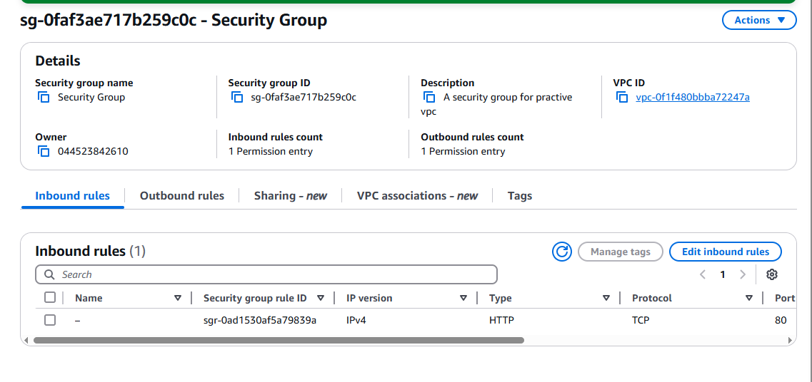

# 🔐 Amazon VPC – Security and Traffic Flow

## 🧭 What is Amazon VPC?

Amazon VPC (Virtual Private Cloud) is a service that allows you to create an isolated, customizable network environment in the AWS cloud. It provides full control over IP address ranges, subnets, route tables, gateways, and security.

---

## 🛠️ How I Used Amazon VPC in This Project

In this project, I used Amazon VPC to build a custom network using Terraform. I:

- Defined a CIDR block
- Created public subnets
- Attached an internet gateway
- Configured a route table for internet access
- Launched an EC2 instance inside the VPC

---

## 🧠 One Thing I Didn't Expect

One thing I didn’t expect was that assigning a public IP to an EC2 instance doesn't guarantee internet access. A proper route must exist in the subnet’s route table that points to an internet gateway — otherwise, there’s no connectivity.

---

## ⏱️ Time Spent

This project took me about an hour. Most of the time was spent understanding how VPC components—subnets, route tables, internet gateways, and security groups—interact to control traffic.

---

## 📦 VPC Routing & Access

### 🔹 What are Route Tables?

Route tables are sets of rules that determine how traffic is directed in a VPC. They define the paths that traffic follows to reach other subnets, the internet, or external networks.

### 🔹 Why Do We Need Them for Public Subnets?

Route tables are needed to make a subnet public because they must include a route to the internet gateway (`0.0.0.0/0`). Without it, public IPs won't work.

### 🔹 Route Destination & Target

Routes are defined by a destination (IP range to match) and a target (where to send the traffic, like an IGW or NAT gateway).

- My route had a **destination** of `0.0.0.0/0`
- And a **target** of my internet gateway (e.g., `igw-xxxxxxxx`)

---

## 🛡️ Security Groups

### What Are They?

Security groups are virtual firewalls for EC2 instances. They allow or deny traffic based on protocol, port, and source IP at the instance level.

### Inbound Rules

Inbound rules control **incoming** traffic. I configured rules to allow:

- SSH (TCP 22) from `0.0.0.0/0`
- HTTP (TCP 80) from `0.0.0.0/0`

### Outbound Rules

Outbound rules control **outgoing** traffic. By default, all outbound traffic is allowed (to `0.0.0.0/0` on any port/protocol).

---

## 🌐 Network ACLs

### What Are They?

Network ACLs (NACLs) are **stateless** firewalls at the subnet level. They control inbound and outbound traffic for the entire subnet using IP, port, and protocol rules.

### Security Group vs. Network ACL

- **Security groups** are stateful and apply to instances
- **Network ACLs** are stateless and apply to subnets
- ACLs require rules for both directions, security groups do not

### Default vs Custom NACLs

- **Default NACLs** allow all traffic by default
- **Custom NACLs** deny all traffic until you add specific allow rules

---

## 👤 Author

**Name:** Jiyoung Lee  
github.com/ez0130


PART 1: Use AWS CLI to Create VPC Resources in a New Region

1. Set the region
```text 
aws configure set region us-east-2
```
2. Create a VPC
``` text
aws ec2 create-vpc \
  --cidr-block 10.1.0.0/16 \
  --region us-east-2
```
3. Create a subnet in that VPC
```text
 aws ec2 create-subnet \
  --vpc-id vpc-xxxxxxxx \
  --cidr-block 10.1.1.0/24 \
  --availability-zone us-east-2a \
  --region us-east-2
```
4. Creat an internet gateway
```text
   aws ec2 attach-internet-gateway \
  --internet-gateway-id igw-xxxxxxxx \
  --vpc-id vpc-xxxxxxxx \
  --region us-east-2
```
PART 2: Use EC2 Global View to Track Resources Across Regions
```text
for region in $(aws ec2 describe-regions --query "Regions[].RegionName" --output text)
do
  echo "📍 $region"
  aws ec2 describe-vpcs --region $region --query "Vpcs[].VpcId"
done
```
