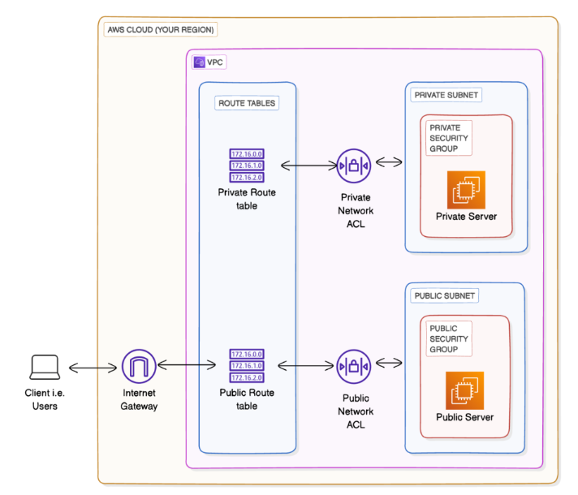
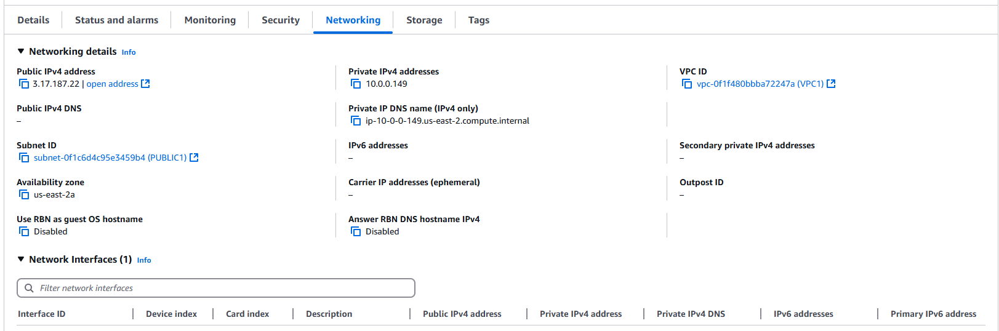
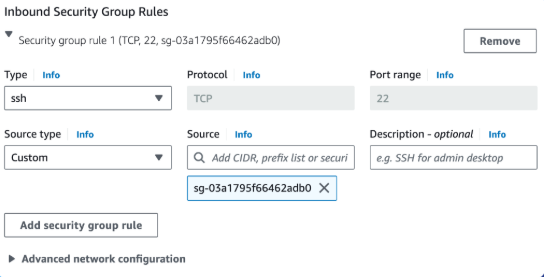
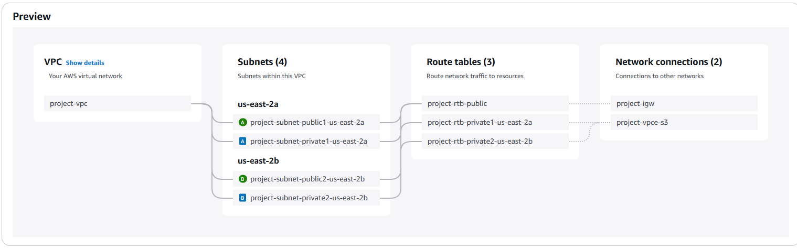
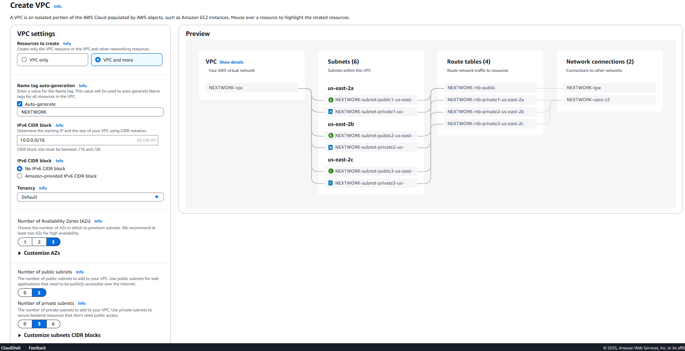

# ☁️ Amazon VPC Project – Launching EC2 with Public & Private Access

## 📘 What is Amazon VPC?

Amazon VPC (Virtual Private Cloud) lets you create a secure, isolated cloud network in AWS.  
It’s useful because it gives full control over IP ranges, subnets, and network access, allowing safe deployment of resources like EC2 instances.

---

## 🛠️ How I Used Amazon VPC in This Project

I used Amazon VPC to create a custom network with public and private subnets, route tables, and an internet gateway.  
I launched an EC2 instance in a public subnet to host a web server and another in a private subnet for internal communication.

---

## 😮 One Thing I Didn't Expect

I didn’t expect that assigning a public IP isn’t enough for internet access.  
I had to configure the subnet’s route table to point to an internet gateway for the EC2 instance to reach the internet.

---

## ⏱️ Time Spent

This project took me a few focused hours.  
Most of the time was spent understanding how networking components interact, but once the flow made sense, setting up everything in Terraform became much faster.

---

## 🔑 Direct Access to EC2 (SSH)

- **Directly accessing a virtual machine** means connecting to it over the internet using an SSH client and a private key.
- **SSH traffic** means encrypted command-line access over port 22 secured by key pair authentication.
- **Key pairs** are a public and private key used to authenticate into EC2 instances. The private key is in `.pem` format, which is standard for AWS.
- To enable access, I configured the instance’s networking by assigning a public IP, ensuring a valid route to the internet gateway, and allowing inbound SSH (port 22) in the security group.

---

## 🧱 Launching Public & Private Servers

- **Public server:** Launched with a public IP and a security group that allows inbound SSH (22) and HTTP (80) from `0.0.0.0/0`.
- **Private server:** Launched in a private subnet with a dedicated security group that only accepts traffic **from the public server’s security group**. This allows private, internal-only communication between the servers.

---

## ⚡ Speeding Up VPC Creation

This time I used the **VPC Wizard** in the AWS Console instead of Terraform to create a complete VPC with subnets, route tables, and gateways in just a few clicks.

- **VPC resource map**: A visual layout of your VPC components and how they interact.
- **CIDR block:** My new VPC used `10.0.0.0/16`, which can be reused across regions because VPCs are isolated unless connected by peering.

---

## 🌐 Public Subnets and NAT Gateways

- I could create **1 or 2 public subnets**, depending on the number of availability zones selected in the wizard.
- **NAT Gateways** were offered to allow private subnets to access the internet securely without exposing them to inbound traffic.

---

## 👤 Author

**Name:** Jiyoung Lee  
github.com/ez0130
