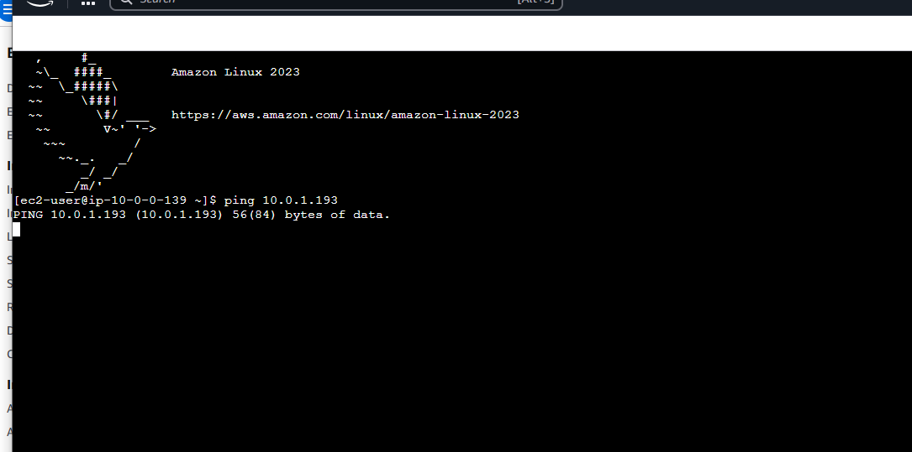

# 🌐 Amazon VPC – Testing EC2 Connectivity

## 📘 What is Amazon VPC?

Amazon VPC lets you build isolated, customizable cloud networks.  
It’s useful because it gives control over IP ranges, subnets, and traffic flow, allowing secure deployment of AWS resources like EC2 instances.

---

## 🛠️ How I Used Amazon VPC in This Project

I used Amazon VPC to create a custom network with public and private subnets, route tables, and gateways.  
I deployed EC2 instances in each subnet and configured traffic rules for secure communication and internet access.

---

## 😮 One Thing I Didn't Expect

I didn’t expect that a public IP alone wouldn’t allow internet access.  
I had to add a route to an internet gateway in the subnet’s route table to enable actual internet traffic.

---

## ⏱️ Time Spent

This project took about one hour. Most time was spent understanding how VPC components interact.  
Once that clicked, launching EC2 instances and configuring networking was much quicker.

---

## 🔑 Connecting to EC2

### EC2 Instance Connect

I connected to my EC2 instance using EC2 Instance Connect, which is a browser-based SSH service provided by AWS.  
It allows secure access without needing a `.pem` key file or a local SSH client.

My first connectivity test was whether I could connect to the EC2 instance in the public subnet using EC2 Instance Connect.  
At first, I got an error because the security group didn’t allow SSH (port 22).  
I fixed it by adding an SSH rule to the security group.

---

## 🔁 Connectivity Between Public and Private Servers

To test connectivity between servers, I used:

```bash
ping 10.0.0.193
```
 Troubleshooting Connectivity
I troubleshooted this issue by checking the security group rules and network ACLs for both instances.


Testing Internet Access with Curl
What is curl?
Curl is a command-line tool that sends requests to a server and gets responses, often used to test HTTP connectivity.

Why I used curl
I used curl to confirm my EC2 instance had outbound internet access and could send/receive web traffic.

Ping vs Curl
Ping checks low-level network connectivity using ICMP, while curl checks application-level connectivity by performing HTTP requests and displaying responses.

Command Example
```bash
curl http://example.com
```





Author
Name: Jiyoung Lee
github.com/ez0130
