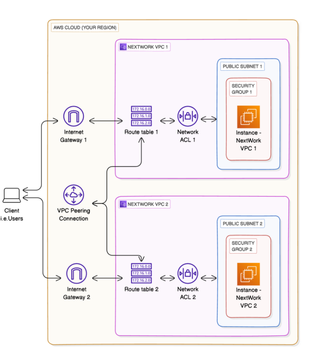
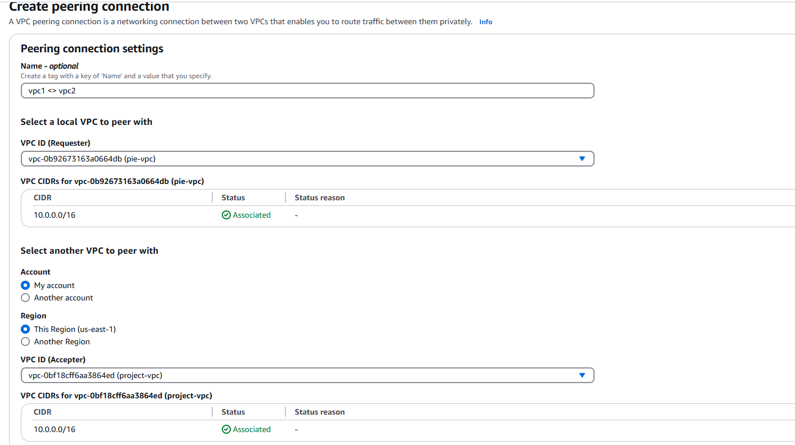
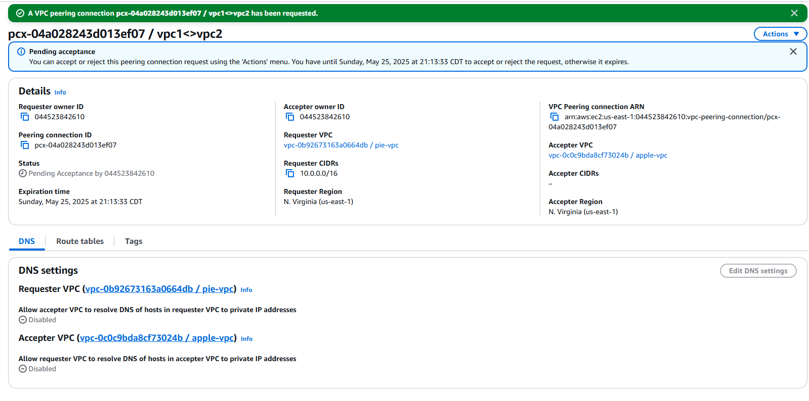
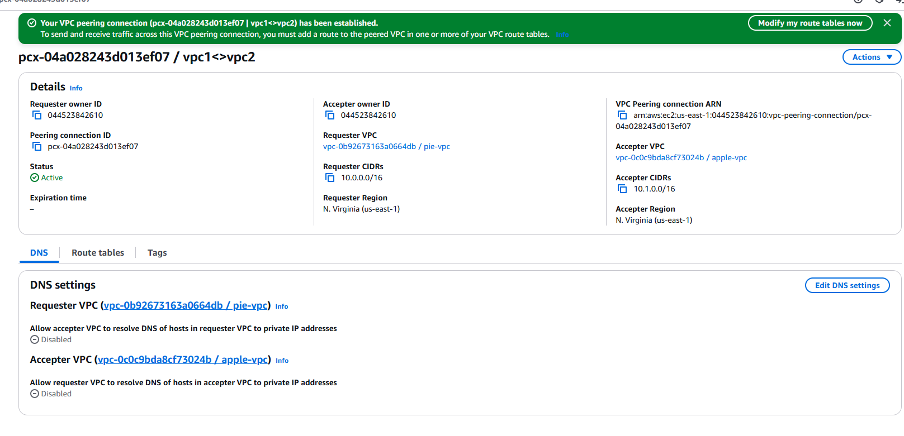
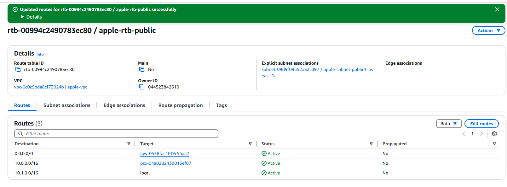
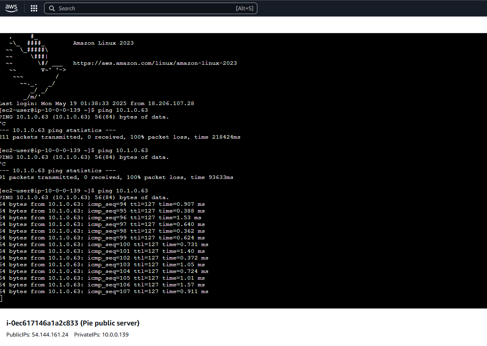

# 🔁 Amazon VPC Peering Project

## 📘 What is Amazon VPC?

Amazon VPC (Virtual Private Cloud) lets you create isolated, customizable cloud networks.  
It’s useful because it gives control over IP ranges, subnets, and routing, enabling secure deployment of AWS resources like EC2 instances.

---

## 🛠️ Project Overview

In this project, I set up two separate VPCs and connected them using **VPC Peering**.  
Each VPC had its own subnet and EC2 instance. My goal was to enable **private communication** between the two EC2 instances using their **private IPs**.

---

## 🧱 Project Steps

### 🔹 Step 1 - Set Up Two VPCs  
I launched two VPCs with non-overlapping CIDR blocks and deployed one EC2 instance in each.

### 🔹 Step 2 - Create a Peering Connection  
I created a VPC peering connection between the two VPCs. One acted as the **Requester**, the other as the **Accepter**.



### 🔹 Step 3 - Update Route Tables  
After accepting the connection, I added routes in each VPC’s route table to direct traffic to the peer VPC via the peering connection.

- **My VPCs' new routes** had:
  - **Destination:** the CIDR block of the peer VPC (e.g. `10.1.0.0/16`)
  - **Target:** the VPC peering connection ID

### 🔹 Step 4 - Launch EC2 Instances  
I launched two EC2 instances, one in each VPC, for connectivity testing.

---

## 💡 What I Didn't Expect

I didn’t expect that VPC peering wouldn’t automatically enable communication.  
Manual updates to route tables and security groups were required to allow traffic between EC2 instances.

---

## ✅ Testing Connectivity

### 🔹 Step 5 - Use EC2 Instance Connect  
Next, I used **EC2 Instance Connect** to SSH into the public EC2 instance via the AWS Console.  
It was convenient because I didn’t need to manage `.pem` key files.

### ❌ Instance Connect Error  
I was stopped from using EC2 Instance Connect as my EC2 instance didn’t have a public IP address.

### 🛠️ Solution: Elastic IP  
To resolve this, I associated an **Elastic IP** with the instance.

- **Elastic IPs** are static public IPs that allow consistent internet access.
- Associating one gave the instance a public IP so EC2 Instance Connect could reach it.

---

## 📡 Ping Test for VPC Peering

To test VPC peering, I ran:

```bash
ping <private-IP-of-peer-instance>

```

 What I Learned
How VPC peering allows private cross-VPC communication

The importance of updating route tables and security groups

Troubleshooting with Elastic IP and ping tests


### Author
Name: Jiyoung Lee
github.com/ez0130
