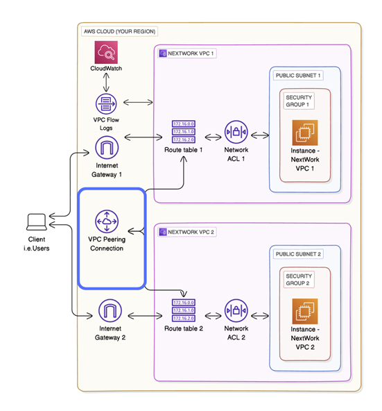
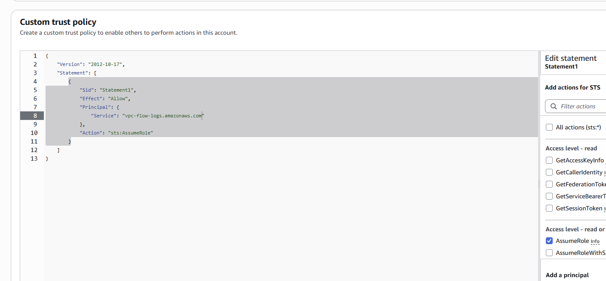
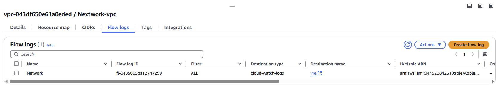
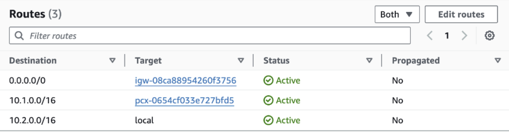
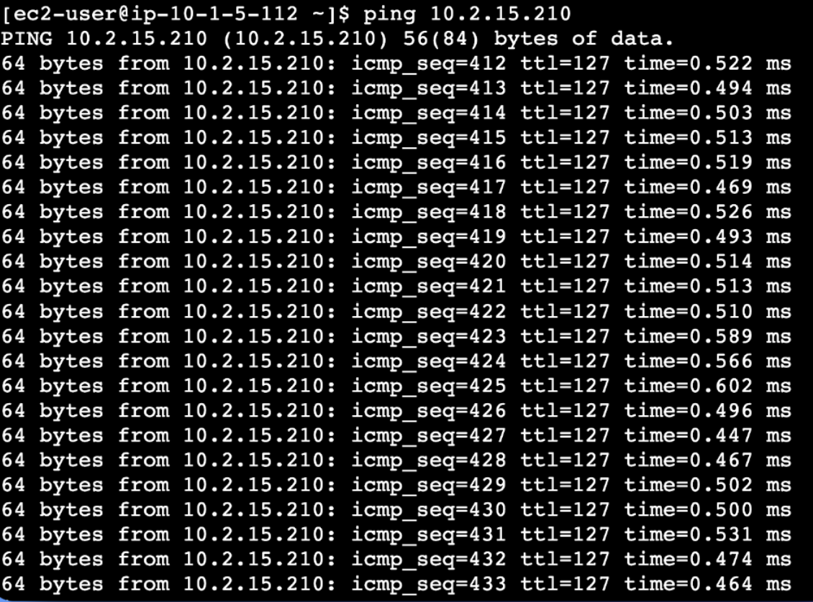
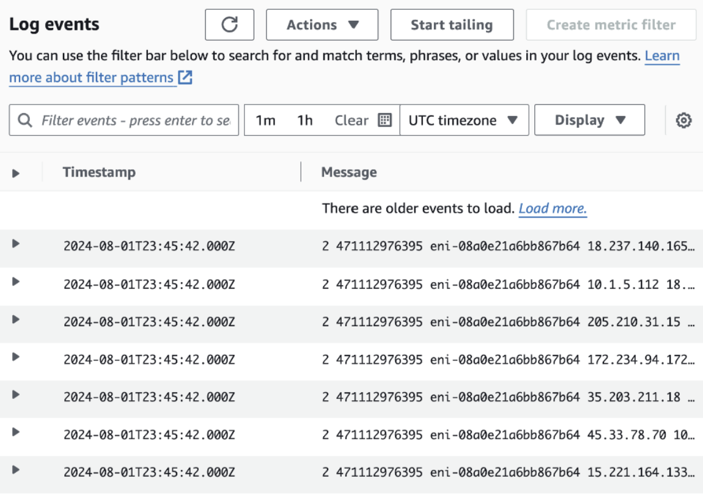
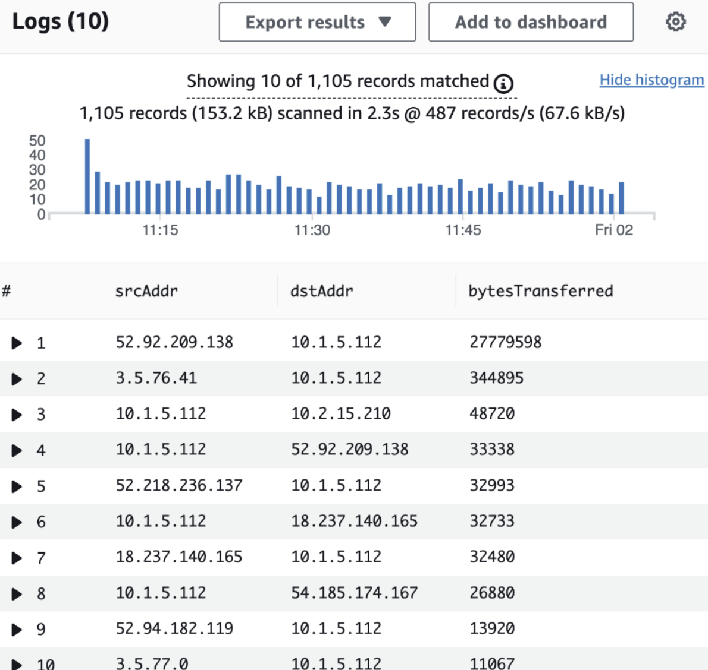

#  VPC Monitoring with Flow Logs

This project demonstrates how to monitor traffic across AWS VPCs using **VPC Flow Logs** and **CloudWatch Logs Insights**. It includes setting up two VPCs, peering them, enabling flow logs, and analyzing traffic patterns.

##  What is Amazon VPC?

Amazon VPC lets you launch AWS resources in a logically isolated network. It’s useful for controlling traffic and improving security. I used it to create subnets, configure route tables, and establish VPC peering.

##  What I Did

### Step 1: Set Up VPCs
Created two VPCs with unique CIDR blocks to avoid overlap and routing conflicts.

### Step 2: Launch EC2 Instances
Deployed one EC2 instance per VPC for testing connectivity.

### Step 3: Enable Flow Logs
Enabled VPC Flow Logs to monitor traffic. Logs were sent to **CloudWatch Log Groups** for analysis.

### Step 4: IAM Role and Policy for Flow Logs
Created an IAM role with a **custom trust policy**:

```json
{
  "Version": "2012-10-17",
  "Statement": [
    {
      "Effect": "Allow",
      "Principal": {
        "Service": "vpc-flow-logs.amazonaws.com"
      },
      "Action": "sts:AssumeRole"
    }
  ]
}
```

Attached policy: CloudWatchLogsFullAccess or a scoped custom policy to allow log writing.

Step 5: VPC Peering
Set up a VPC peering connection so instances could communicate across VPCs. Updated route tables accordingly.

Step 6: Connectivity Testing
Used ping to confirm private IP communication.  Successful ping replies confirmed peering and routing worked.


Step 7: Flow Log Analysis
Flow logs showed:


Source/Destination IPs

Ports

Protocol

ACCEPT/REJECT status

Byte count

Step 8: CloudWatch Logs Insights

Used queries like:
```sql
fields @timestamp, srcAddr, dstAddr, action
| filter action = "ACCEPT"
| stats count() by srcAddr, dstAddr
```
To find top talkers and connection patterns.

### What Surprised Me
Flow logs were far more detailed than expected, offering deep visibility into traffic.

### Time Taken
About 1–2 hours total.

### AWS CLI Cleanup – Deleting VPC with Dependencies
If VPC deletion fails due to security group dependencies:

### Step 1: Find Attached Resources
```bash
aws ec2 describe-network-interfaces \
  --filters Name=group-id,Values=sg-06deb578e697761de \
  --query 'NetworkInterfaces[*].{ID:NetworkInterfaceId,Status:Status,Attachment:Attachment.InstanceId}' \
  --output table
```
Step 2: Detach/Delete ENI or Terminate Instance
``` bash
## If attached to EC2
aws ec2 terminate-instances --instance-ids i-xxxxxxxxxxxxx

## If not, detach and delete ENI manually
aws ec2 detach-network-interface --attachment-id eni-attach-xxxxxxxx
aws ec2 delete-network-interface --network-interface-id eni-xxxxxxxx
```
Step 3: Delete VPC
```bash
aws ec2 delete-vpc --vpc-id vpc-0b92673163a0664db
```

Author
Jiyoung Lee
github.com/ez0130
