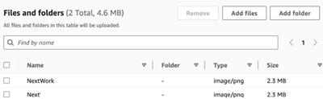
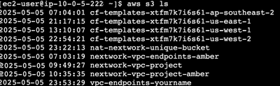

#  Access S3 from a VPC

This project demonstrates how to connect an EC2 instance within a VPC to an S3 bucket using the AWS CLI. It walks through setting up the architecture, configuring access keys, and uploading objects to S3.

---

##  What is Amazon VPC and Why Is It Useful?

Amazon VPC (Virtual Private Cloud) is a service that lets you create a logically isolated network in the AWS cloud. It gives you full control over your network settings, such as IP ranges, subnets, route tables, and gateways.

It’s useful because it allows you to securely run AWS resources in a customizable virtual network. You can control inbound and outbound traffic, connect securely to on-premises networks, and isolate environments for better security and performance.

---

##  Project Overview

### One thing I didn't expect in this project was...
That I can upload files directly from EC2 to S3 using the AWS CLI.

### This project took me...
About an hour.

---

##  Project Steps

### Step 1 - Architecture Setup
I connected an EC2 instance to a VPC and set up a new S3 bucket for file storage.

### Step 2 - Connect to EC2
I logged in to my EC2 instance using SSH to prepare it for AWS CLI usage.

### Step 3 - Set Up Access Keys
I generated AWS access keys and used them to configure the AWS CLI on my EC2 instance.

---

##  Access Keys and AWS CLI

### What is AWS CLI?
AWS CLI is a command-line tool that lets you manage AWS services and resources using terminal commands. I have access to AWS CLI because I configured it with my AWS credentials, allowing me to control AWS infrastructure directly from my computer.

### Purpose of `aws configure`
To set up my EC2 instance to interact with my AWS environment, I configured the AWS CLI using the `aws configure` command. This let me input my access key, secret key, default region, and output format to authenticate and manage AWS resources.

### What did the terminal respond with?
When I ran the command `aws configure` again, the terminal responded with prompts for my AWS access key ID, secret access key, default region, and output format. This indicated that the AWS CLI was ready to store new credentials and settings for future commands.

### What are access keys?
Access keys are credentials that consist of an access key ID and secret access key. They allow programmatic access to the AWS account, such as using the AWS CLI or SDKs, enabling you to manage resources without logging into the AWS Console.

### What is a secret access key?
Secret access keys are the private part of your AWS credentials, used together with the access key ID to sign API requests. They must be kept secure, as anyone with access can control your AWS resources.

### Best Practice Alternative
Although I'm using access keys in this project, a best practice alternative is to use IAM roles with temporary credentials, especially when running code on AWS services like EC2 or Lambda. This improves security by avoiding long-term credentials.

---

##  Working with S3

### Step 4 - Create S3 Bucket
I created a new S3 bucket to use for testing uploads from my EC2 instance.

### Step 5 - Connect EC2 to S3
I ran the following commands to verify that my EC2 instance could access the S3 bucket.

```bash
aws s3 ls
aws s3 ls s3://nextwork-vpc-project-amber
```
### Uploading Files to S3
I created and uploaded a test file from EC2 to S3:
```bash
sudo touch /tmp/test.txt
aws s3 cp /tmp/test.txt s3://nextwork-vpc-project-yourname
aws s3 ls s3://nextwork-vpc-project-yourname
```


These commands confirmed successful communication between EC2 and S3, completing the integration.

### Author
Jiyoung Lee
GitHub: github.com/ez0130
