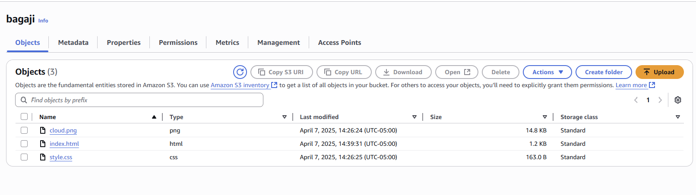
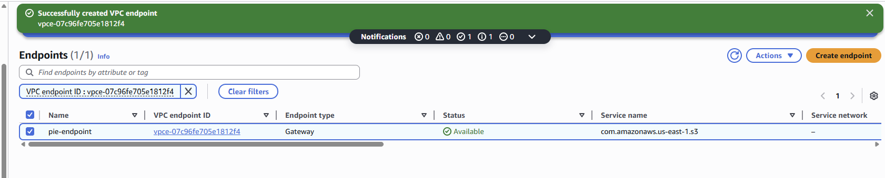
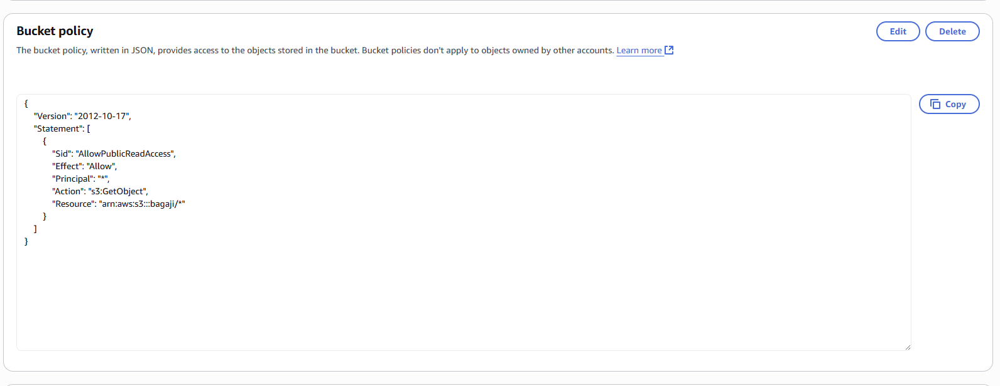
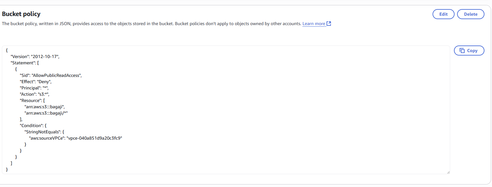
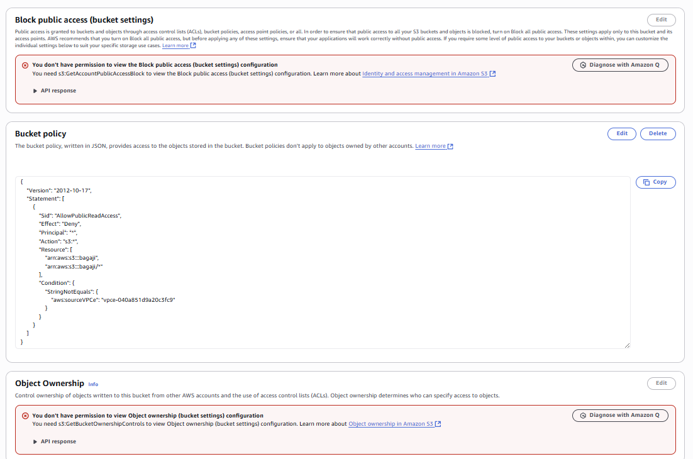
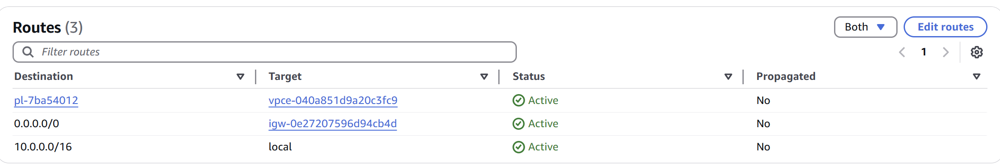
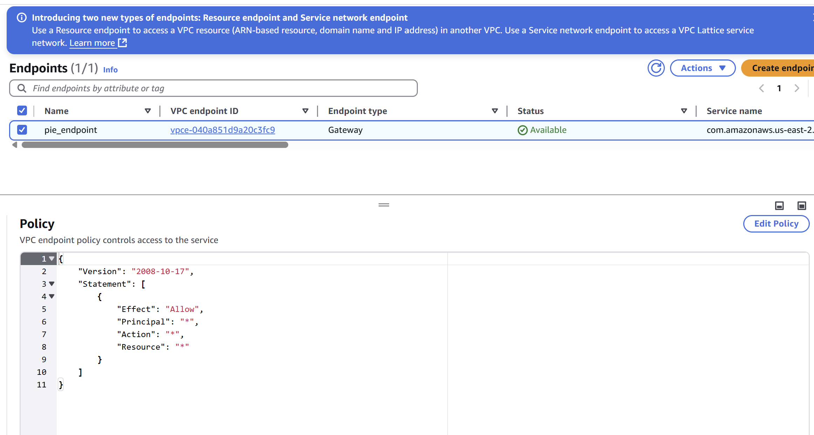

# 🔐 VPC Endpoints Project

This project demonstrates how to securely connect an EC2 instance within a VPC to an S3 bucket using a **Gateway VPC Endpoint**. The goal is to ensure that all traffic remains private and does not traverse the public internet.

---

## 📌 What is Amazon VPC and Why Is It Useful?

Amazon VPC lets you create a private, isolated network in AWS. It’s useful for securely launching resources, controlling traffic flow, and customizing IP ranges, subnets, route tables, and gateways.

---

## 💡 Project Overview

- **How I used Amazon VPC**:  
  I launched an EC2 instance in a private network, connected it to an S3 bucket using a VPC endpoint, and controlled access with security groups, route tables, and endpoint policies.

- **Unexpected Discovery**:  
  I didn’t expect that blocking all public access to the S3 bucket would also block AWS Console access unless the VPC endpoint was explicitly allowed.

- **Time Taken**:  
  About one hour!

---

## 🛠️ Project Steps

### Step 1 – Architecture Setup
Created a VPC, EC2 instance, and an S3 bucket.

### Step 2 – Connect to EC2 Instance
Connected via SSH to prepare for testing access to S3 through the VPC endpoint.

### Step 3 – Set Up Access Keys
Used `aws configure` to set up credentials:
```bash
aws configure
```

### Step 4 – Interact with S3 from EC2
After setting up AWS CLI, I ran the following commands to confirm access from EC2 to the S3 bucket:

```bash
aws s3 ls
aws s3 ls s3://nextwork-vpc-endpoints-amare
```
The command responded with a list of objects in the bucket, confirming successful access using access keys and network setup.

### Step 5 – Uploading to S3
To verify write access, I created and uploaded a file from EC2 to S3:

```bash
sudo touch /tmp/nextwork.txt
aws s3 cp /tmp/nextwork.txt s3://nextwork-vpc-endpoints-yourname
aws s3 ls s3://nextwork-vpc-endpoints-yourname
```
This showed the uploaded file, proving both read and write access through the EC2 instance.

### Step 6 – Set Up a Gateway
I created an S3 Gateway Endpoint, which is a type of VPC endpoint that allows EC2 instances to privately connect to S3 without using a NAT, internet gateway, or public IP. This keeps all traffic internal and secure.

### Step 7 – Create Secure Bucket Policy
To validate the endpoint, I applied a restrictive bucket policy that denies all access except from my VPC endpoint.


```json
{
  "Effect": "Deny",
  "Principal": "*",
  "Action": "s3:*",
  "Resource": "arn:aws:s3:::bagaji/*",
  "Condition": {
    "StringNotEquals": {
      "aws:sourceVpce": "vpce-040a851d9a20c3fc9"
    }
  }
}
```
Once applied, I saw "Access Denied" messages from the AWS Console, confirming that only the VPC endpoint could access the bucket.

### Step 8 – Update Route Tables
Why?
My EC2 instance needed a route to S3 through the endpoint. Without it, traffic wouldn’t stay private.

How?
I updated the route table associated with the EC2’s subnet, ensuring it was linked to the VPC endpoint. I avoided using prefix lists, since they aren’t supported with Gateway Endpoints.

### Endpoint Policy
What is an Endpoint Policy?
An endpoint policy is a resource-based policy attached to a VPC endpoint. It controls which AWS services and resources can be accessed through that endpoint.

### What I Did
I updated the endpoint policy to allow access to a specific S3 bucket only. I saw the effect immediately—my EC2 instance could access just that bucket and nothing else.

### Final Validation
I tested again with:

```bash
aws s3 ls s3://nextwork-vpc-endpoints-yourname
✅ If the command worked, it meant the S3 bucket was accessed only through the private endpoint—confirming that everything was configured securely and correctly.
```

### Author
Jiyoung Lee
GitHub: github.com/ez0130
