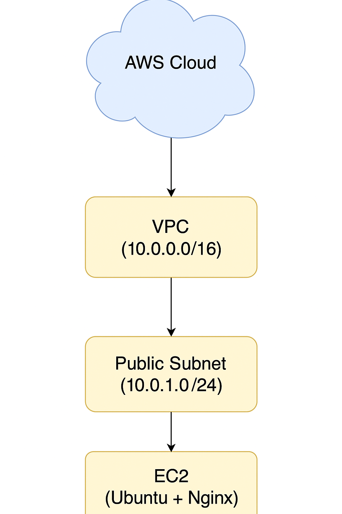

## Terraform AWS EC2 웹서버 자동 배포 프로젝트

### 프로젝트 개요

Terraform을 사용해 AWS 상에 기본적인 네트워크 인프라(VPC, Subnet, IGW, Route Table, Security Group)를 구성하고, 퍼블릭 서브넷 내에 EC2 인스턴스를 자동으로 생성하여 Nginx 웹서버를 설치하고 구동하는 인프라를 코드로 관리한 프로젝트입니다. 해당 프로젝트는 이후 모듈화 실습을 통해 코드 재사용성과 유지보수성을 강화합니다.

### 사용 기술 및 도구

Infrastructure as Code (IaC): Terraform

클라우드 플랫폼: AWS (us-east-2 리전)

OS: Ubuntu 20.04 (EC2 AMI)

WSL2 (Ubuntu) 환경에서 실행

AWS CLI, SSH 등 활용

### 구축 인프라 구성도

  AWS Cloud    
      VPC (10.0.0.0/16)
         Subnet (Public)  
         CIDR: 10.0.1.0/24 
            EC2 Instance 
            Ubuntu +    
            Nginx       

### 주요 Terraform 리소스 (모듈화 적용)

루트 모듈

main.tf: VPC, EC2, SG 모듈을 호출하는 진입점

variables.tf, outputs.tf, terraform.tfvars

### 모듈 구조

modules/
├── vpc/
│   ├── main.tf
│   ├── variables.tf
│   └── outputs.tf
├── ec2/
│   ├── main.tf
│   ├── variables.tf
│   └── outputs.tf
└── security_group/
    ├── main.tf
    ├── variables.tf
    └── outputs.tf

각 모듈의 리소스:

vpc: VPC, Subnet, IGW, Route Table

security_group: SSH, HTTP 포트 허용

ec2: EC2 생성 및 user_data 구성 포함

### user_data (EC2 부팅 시 자동 실행 스크립트)

#!/bin/bash
apt update -y
apt install -y nginx
echo "<h1>Hello from Terraform EC2 with user_data!</h1>" > /var/www/html/index.html
systemctl enable nginx
systemctl start nginx

### 테스트 및 결과

terraform apply 실행 시 VPC 및 EC2 모듈이 호출되어 리소스 자동 생성

Nginx 웹서버가 자동 설치 및 실행됨

퍼블릭 IP로 웹 접속 성공

### 학습 포인트

모듈 기반 인프라 코드 구조 구성법

AWS 네트워크 기초 (VPC, Subnet, IGW, Route Table 등)

Terraform 상태 관리와 재사용성 향상 기법

user_data를 통한 EC2 부트스트랩 자동화

### 주의사항 및 과금 관리

실습 후 반드시 terraform destroy 명령으로 리소스 제거해 비용 방지

EC2 t3.micro 사용 시 프리티어 가능 (단, 월 750시간 이내)

### 향후 확장 방향

S3 + CloudFront 정적 웹사이트 호스팅 자동화

RDS + EC2로 3티어 아키텍처 구성

비용 알림 자동화 (AWS Budget + SNS)

### 작성자

이름: Jiyoung Lee
GitHub: https://github.com/ez0130
